# Product Discovery: Private Club Padel Platform

**Status:** Working baseline — owner decisions recorded July 11, 2026  
**Scope:** One private club initially; multi-club capable later  
**Decision gate:** Core launch-policy questions answered; remaining technical choices will use the documented defaults and be captured as reversible architecture decisions

## Owner decisions recorded

| Topic | Decision |
|---|---|
| Operating market | Mexico |
| Currency | Mexican peso (MXN) |
| Timezone | Central Time; implementation will use the IANA zone `America/Matamoros` unless the club's physical location requires another Mexican Central zone |
| Player access | Open application, followed by club approval where membership or event eligibility requires verification |
| Authentication | Owner has no required method; use email magic link plus Google sign-in for launch, with secure account recovery. Password credentials and Apple sign-in are deferred unless testing shows a need |
| Existing data | No legacy player, match, or rating import |
| Initial rating | Seed from administrator-verified existing player levels, with high initial uncertainty until match evidence accumulates |
| Result confirmation | Official immediately when an opposing team verifies; otherwise official after 24 hours if no dispute is filed; authorized staff may verify or correct with an audit reason |
| Junior accounts | Not in MVP |
| Payments | Not in MVP |

Open application does not mean automatic club membership or unrestricted event entry. Applicants may create an account and profile, while verified level, membership, protected events, and staff capabilities remain approval-controlled.

## 1. Product summary

Build a mobile-first, bilingual (English/Spanish) web application and installable PWA that gives a private padel club one reliable operational system for players, courts, verified match results, ratings, tournaments, schedules, and public live results.

The first release should solve the club's most frequent workflows exceptionally well:

- A player joins or is invited, maintains a profile, and sees their next match and rating.
- An administrator creates an event, accepts registrations, generates a draw and schedule, and operates courts.
- Players enter a score in under one minute; opponents or staff confirm it; every change is auditable.
- Spectators open a public link to see schedules, live results, standings, and brackets without an account.
- A deterministic doubles rating and separate ranking table make competitive level understandable.

### Success outcomes

Initial targets to validate with the owner:

| Outcome | Proposed measure | Initial target |
|---|---|---:|
| Player adoption | Active club players with claimed profiles | 80% within 90 days |
| Administrative efficiency | Time to create a basic social event | Under 5 minutes |
| Score-entry usability | Median time to submit a score | Under 1 minute |
| Result reliability | Results needing administrator correction | Under 2% |
| Event engagement | Registrations completed digitally | 90% |
| Public usefulness | Published events with current schedules/results | 95% |

## 2. Users and priority jobs

| User | MVP priority job |
|---|---|
| Club owner | Configure the club, policies, staff access, and review participation |
| Club administrator | Manage players/courts, create events, resolve conflicts and disputed scores |
| Tournament director | Run assigned events, schedules, courts, draws, and results |
| Player | Register, find the next match, submit/confirm scores, understand rating changes |
| Guest player | Participate immediately and later claim the accumulated history |
| Spectator | View public schedules, standings, brackets, and live results |
| Platform super admin | Deferred operational UI; retain a minimal support role in the authorization model |

Team captain is deferred until team competitions enter scope.

## 3. Owner decisions required

These questions are prioritized by whether they materially change architecture, legal obligations, or the rating model.

### A. Blocking before production architecture or data migration

1. **Club jurisdiction and currency:** In which country/state will the first club operate, and what currency and tax rules apply? This affects privacy, minors, messaging, payments, and retention.
2. **Identity and access:** Is the club invite-only, membership-roster-only, or open to applications? Which sign-in methods must launch on day one: email/password, magic link, Google, and/or Apple?
3. **Existing data:** What player, rating, match, membership, and court data must be imported, in which formats, and which system is authoritative during rollout?
4. **Eligibility policy:** Are categories based on gender, age, verified level, membership, or combinations of these? Who may override eligibility?
5. **Rating launch policy:** Should existing club ratings seed the new model, should all players start provisional, or should administrators assign initial ratings? What scale should players see?
6. **Official-result policy:** Who must confirm a player-submitted result, how long is the confirmation window, and does silence count as confirmation?
7. **Hosting/data residency:** Is a particular cloud region or vendor required? Is storage outside the operating country permitted?
8. **Minor accounts:** Will juniors be included in MVP? If yes, what age threshold and parent/guardian consent and visibility rules apply?

### B. Blocking before the relevant MVP module is finalized

9. What are the exact court operating hours, court types, blackout rules, and usual match durations?
10. Which event registrations require staff approval, payment, waiver acceptance, or partner confirmation?
11. Which scoring formats are actually used today, including golden point, set formats, walkovers, retirements, and timed rounds?
12. Which tie-break sequence does the club use for each launch format?
13. Are rankings one overall table, category-specific tables, seasonal tables, or a combination? What minimum match count and inactivity rule apply?
14. May friendly matches affect rating, and may players opt a match into or out of rating impact?
15. Which channels are required at launch: in-app, email, web push, SMS, or WhatsApp?
16. Must court booking integrate with an existing reservation system, or is event court allocation independent in MVP?
17. Is payment collection required for initial release? The instruction set says advanced payments may be deferred, but registration rules may depend on payment status.
18. Who can see player names, photos, ratings, match history, and junior profiles on public pages?

### C. Non-blocking decisions with proposed defaults

| Decision | Proposed default |
|---|---|
| Initial tenancy | One club and one location in the UI; every tenant-owned record carries `club_id`, and courts carry `location_id` |
| Languages | English and Spanish from the first screen; English club default; user preference overrides it |
| Time handling | Store UTC instants, store club/location IANA timezone, render in viewer/club context |
| Public access | Event pages public by unguessable slug; player details limited by explicit consent |
| Score confirmation | Either opposing team confirms; otherwise auto-confirm after 48 hours if undisputed; staff can confirm or correct with reason |
| Guest claim | Signed, expiring invitation; claiming links the guest record to a user without rewriting match history |
| Ranking windows | Overall current rating plus rolling 3-, 6-, and 12-month achievement tables |
| Rating eligibility | Competitive, ranked, league, and tournament matches; friendlies excluded by default |
| New players | Provisional for first 10 eligible matches with visibly high uncertainty |
| Duplicate protection | Client idempotency key plus server uniqueness constraint for score submissions |
| Event publication | Draft and preview first; explicit publish action; published changes notify affected players |
| Accessibility | WCAG 2.2 AA acceptance checks on critical workflows |
| Payments | Defer taking money; preserve provider-neutral payment entities and registration states |
| Native apps | Defer; expose stable application services/API boundaries so native clients can be added later |

## 4. Recommended MVP

### In scope

1. **Foundation**
   - One club and location, multiple locations supported by the model.
   - Email authentication plus one owner-approved passwordless/social option.
   - Roles: owner, administrator, tournament director, player, guest, spectator/public.
   - Player profiles, privacy preferences, guest creation/claim, duplicate merge workflow.
   - Courts, hours, blackouts, and localization.
2. **Matches and trust**
   - Doubles matches, launch scoring formats, set-by-set entry, walkover/retirement/incomplete states.
   - Pending, confirmed, disputed, and void result states.
   - Opponent/staff confirmation, deadline processing, idempotency, immutable audit history.
   - Match and rating history.
3. **Ratings and rankings**
   - Doubles-aware Glicko-2 adaptation with formula versions and calculation snapshots.
   - Provisional status, rating deviation/confidence, event weights, repeat-opponent dampening.
   - Separate rolling ranking-points tables; plain-language explanations.
4. **Events**
   - Multi-category registration, partner registration/request, limits, wait lists, withdrawals, basic eligibility.
   - Americano, Mexicano, round robin, and single-elimination brackets.
   - Deterministic draw/pairing generation and administrator preview/approval.
5. **Scheduling and operations**
   - Court/time assignment respecting availability, duration, rest, conflicts, locks, and court blackouts.
   - Conflict report, manual adjustments, selective recalculation, check-in, court status, score management.
6. **Public and communication**
   - Public event overview, schedule, live results, standings, brackets, and privacy-safe player rankings.
   - TV mode with automatic refresh.
   - In-app and email notifications for core registration, schedule, court, score, and dispute events.
   - Installable PWA with cached read-only event essentials. Offline score submission can follow after online reliability is proven.
7. **Administration and quality**
   - Audit log, basic participation/event reports, CSV export.
   - Permission, rating, tie-break, schedule, localization, accessibility, integration, and end-to-end tests.

### Explicitly deferred

- Payment collection/refunds and settlement reporting.
- Team competitions, team captains, complex leagues, ladders, and challenges.
- AI tournament director, scenario intelligence, sandbagging detection, and development insights.
- SMS/WhatsApp, digital scoreboard, weather automation, sponsor inventory, loyalty, native/watch apps.
- Offline score writes and QR camera workflows (retain compatible data contracts in MVP).
- Advanced analytics and PDF reporting.

### MVP acceptance criteria

- An authorized administrator can create and publish an event in a supported format, register players, generate its draw/rounds, assign courts, and publish a conflict-free schedule.
- A player can find the next match within two primary actions and submit a valid score from a phone in under one minute.
- A score cannot become official outside the configured confirmation workflow; simultaneous and repeated submissions do not create duplicate effects.
- Confirmation commits the match, rating snapshots, rating history, ranking points, and audit entries atomically.
- Regenerating a schedule never changes completed or locked matches.
- Public pages expose no private fields and update live without authentication.
- Critical workflows operate in English and Spanish and pass agreed accessibility checks.

## 5. Rating-system recommendation

### Decision: doubles-aware Glicko-2, with a separate achievement-points ranking

Use a team adaptation of **Glicko-2** as the ability estimator. It is a better initial fit than plain Elo because it models uncertainty (rating deviation), supports provisional players naturally, and responds appropriately after inactivity. A full Bayesian team model such as TrueSkill is attractive for doubles but adds tuning and explanation complexity that is unnecessary for the first private club.

Keep three concepts separate:

- **Rating:** estimated ability, calculated from eligible confirmed matches.
- **Ranking points:** transparent achievement points earned within a season or rolling window.
- **Event standing:** results calculated only inside an event.

### Proposed calculation

1. Form each team's effective rating from both players. Initially use the mean player rating; combine player deviations to express team uncertainty.
2. Calculate expected team outcome from the difference between effective team ratings and uncertainty.
3. Convert the confirmed result to an actual performance value. Match win is primary; a capped margin modifier based on sets/games may be enabled by formula version so lopsided scores add limited evidence without encouraging score farming.
4. Apply Glicko-2 updates to all four players, adjusted by:
   - competition-type weight;
   - match-format reliability;
   - a diminishing repeat-pairing/opponent factor over a configured time window;
   - provisional uncertainty;
   - retirement/walkover policy (walkovers default to no rating effect).
5. Persist inputs, outputs, expected probability, factors, formula version, and a human explanation in one transaction.

### Proposed defaults to validate

- Display scale centered at 1500; initial rating 1500 unless seeded.
- Initial rating deviation 350; provisional badge for first 10 eligible matches.
- Rating floor 500 and ceiling 3000, configurable but not used to hide raw calculation snapshots.
- Friendly weight 0; ranked 1.0; league 1.05; tournament 1.15. These are policy defaults, not hard-coded constants.
- Repeated matches involving substantially the same four players progressively reduce impact after the second match in 30 days.
- Inactivity increases uncertainty rather than directly lowering ability rating. Optional achievement-point decay belongs to ranking policy.
- Walkovers have no rating impact; completed portions of retirements count only under an explicit club rule.

### Integrity and reproducibility

- Only confirmed, eligible results enter the rating ledger.
- Each calculation stores a formula-version ID and immutable JSON snapshot of all inputs and derived factors.
- Corrections append reversal/recalculation transactions; they do not overwrite history.
- Formula simulations run in an isolated scenario and cannot publish without administrator approval.
- Recalculation is deterministic: ordered by official result timestamp, then stable match ID.
- Players see before/after rating, change, expected win probability, confidence, and plain-language reasons.
- Manipulation indicators create review flags only; they never accuse or sanction automatically.

## 6. Version-one tournament formats

Recommend these four formats because together they cover social rotation, dynamic level matching, formal pool play, and a conventional championship while sharing reusable primitives.

| Format | V1 capability | Important boundary |
|---|---|---|
| Americano | Individual, rotating partners, point/timed rounds, rests, uneven counts, individual standings | Team Americano and complex playoff variants can follow |
| Mexicano | Re-pair after each round by standings, court movement, repeated-partner/opponent avoidance | Start with one documented movement policy plus configurable round count |
| Round robin | Fixed teams, groups, single round robin, qualification into knockout | Individual rotating RR and double RR may follow |
| Single elimination | Seeds, random draw, byes, protected seeds, optional third-place match | Double elimination and consolation draws deferred |

King/Queen of the Court is valuable but overlaps with Mexicano/court movement and should be the first post-MVP event format. All generators must accept a deterministic random seed and persist the generated version.

## 7. Draft domain and entity relationship model

This is a conceptual ER model, not an approved physical schema. Identity, authorization, event-format storage, and rating snapshots require owner and architecture approval before migrations.

```mermaid
erDiagram
    CLUB ||--o{ CLUB_LOCATION : has
    CLUB_LOCATION ||--o{ COURT : contains
    CLUB ||--o{ CLUB_MEMBERSHIP : grants
    USER ||--o| PLAYER_PROFILE : owns
    CLUB ||--o{ PLAYER_PROFILE : hosts
    USER ||--o{ CLUB_ROLE_ASSIGNMENT : receives
    CLUB ||--o{ CLUB_ROLE_ASSIGNMENT : scopes
    ROLE ||--o{ CLUB_ROLE_ASSIGNMENT : assigns
    ROLE }o--o{ PERMISSION : includes
    PLAYER_PROFILE ||--o{ PLAYER_RELATIONSHIP : participates
    PLAYER_PROFILE ||--o{ AVAILABILITY : declares

    CLUB ||--o{ EVENT : organizes
    EVENT ||--o{ EVENT_CATEGORY : contains
    EVENT_CATEGORY ||--o{ REGISTRATION : accepts
    PLAYER_PROFILE ||--o{ REGISTRATION : submits
    REGISTRATION ||--o| WAITLIST_ENTRY : may_be
    EVENT_CATEGORY ||--o{ EVENT_STAGE : structures
    EVENT_STAGE ||--o{ EVENT_ENTRY : contains
    EVENT_STAGE ||--o{ GROUP : may_have
    GROUP ||--o{ GROUP_MEMBERSHIP : contains
    GROUP ||--o{ GROUP_STANDING_SNAPSHOT : ranks
    EVENT_STAGE ||--o{ BRACKET_NODE : may_have

    EVENT_CATEGORY ||--o{ MATCH : schedules
    MATCH ||--|{ MATCH_PARTICIPANT : includes
    PLAYER_PROFILE ||--o{ MATCH_PARTICIPANT : plays
    MATCH ||--o{ MATCH_SET : records
    MATCH ||--o{ SCORE_SUBMISSION : receives
    SCORE_SUBMISSION ||--o{ SCORE_CONFIRMATION : receives
    SCORE_SUBMISSION ||--o{ SCORE_DISPUTE : may_raise
    MATCH ||--o| COURT_ASSIGNMENT : receives
    COURT ||--o{ COURT_ASSIGNMENT : hosts
    MATCH ||--o{ CHECK_IN : tracks

    CLUB ||--o{ RATING_FORMULA_VERSION : configures
    PLAYER_PROFILE ||--o{ RATING_ACCOUNT : has
    RATING_ACCOUNT ||--o{ RATING_TRANSACTION : changes
    MATCH ||--o{ RATING_TRANSACTION : causes
    RATING_FORMULA_VERSION ||--o{ RATING_TRANSACTION : calculates
    CLUB ||--o{ RANKING_SEASON : defines
    RANKING_SEASON ||--o{ RANKING_POINTS_TRANSACTION : contains
    PLAYER_PROFILE ||--o{ RANKING_POINTS_TRANSACTION : earns

    EVENT_CATEGORY ||--o{ SCHEDULE_VERSION : generates
    SCHEDULE_VERSION ||--o{ SCHEDULE_SLOT : contains
    SCHEDULE_SLOT ||--o| COURT_ASSIGNMENT : allocates
    USER ||--o{ NOTIFICATION : receives
    CLUB ||--o{ ANNOUNCEMENT : publishes
    USER ||--o{ AUDIT_LOG : acts
    CLUB ||--o{ AUDIT_LOG : records
```



### Modeling notes

- `club_id` is the tenant boundary on all club-owned aggregates; authorization must enforce it server-side.
- `PlayerProfile` represents a person in competition. It may exist without a `User` while a guest, then be claimed without changing its ID or history.
- `Event` contains shared details; `EventCategory` owns eligibility, fee, capacity, format, draw, and schedule policy.
- `EventStage` provides reusable group, round, and knockout phases instead of a separate rigid table for every format.
- `EventEntry` represents an individual or fixed team in a stage; `MatchParticipant` references both the player and team/side context.
- Score submissions are append-only proposals. The official match result references the accepted submission; disputes and corrections remain auditable.
- Scheduling and standings are versioned snapshots, allowing preview, publish, selective regeneration, and reproducibility.
- Rating and ranking transactions are ledgers. Current values are projections that can be rebuilt from immutable transactions.
- Membership/billing, waivers, files, sponsors, payments, refunds, discounts, and advanced league entities remain part of the future domain but need not be implemented in the first vertical slice.

## 8. Page and navigation map

Navigation should be role-adaptive. Players get a bottom navigation on phones; organizers get an additional management workspace. Public event URLs require no login.

```text
Public
├── Club home
├── Events
│   └── Event
│       ├── Overview / registration
│       ├── Schedule & courts
│       ├── Live results
│       ├── Standings
│       └── Bracket
├── Club rankings
├── Public player profile (consent-limited)
└── TV mode

Player app
├── Home
│   ├── Next match
│   ├── Required actions
│   └── Rating snapshot
├── Play
│   ├── My matches
│   ├── Create match
│   ├── Submit score
│   └── Confirm / dispute result
├── Events
│   ├── Browse / filter
│   ├── Event details
│   ├── Register / partner request
│   └── My events
├── Rankings
│   ├── Club ranking
│   ├── My rating history
│   └── Rating explanation
├── Notifications
└── Profile
    ├── Playing profile
    ├── Availability
    ├── Language & notifications
    └── Privacy & account

Organizer workspace
├── Dashboard
├── Players & guests
├── Events
│   ├── Create-event wizard
│   └── Event operations
│       ├── Categories & rules
│       ├── Registrations / wait list
│       ├── Draw / rounds / seeding
│       ├── Schedule preview & conflicts
│       ├── Courts / check-in
│       ├── Scores / disputes
│       ├── Communications
│       └── Publish / TV controls
├── Matches
├── Ratings & rankings
│   ├── Policy / formula versions
│   ├── Recalculation preview
│   └── Review flags
├── Courts & operating hours
├── Reports / exports
└── Audit log

Owner settings
├── Club / locations / branding
├── Staff roles & permissions
├── Competition and confirmation policies
├── Localization and terminology
├── Privacy / retention / consent
└── Integrations (later)
```

### Main workflow wireframe notes

- **Player home:** next-match card first, with time, court, partner/opponents, check-in state, and one primary action. Required score confirmations appear immediately below.
- **Score entry:** select outcome state, enter sets in a compact grid, validate padel scoring inline, preview, submit. The confirmation state is unmistakable.
- **Create event:** Basic step (name/date/category/capacity) → format step with recommended defaults → courts/time → registration policy → preview → publish. Advanced settings remain collapsed.
- **Court control:** responsive court cards showing live/current/next/delay state; administrators can call players, start/finish, move court, or open score entry.
- **Public event:** sticky category selector and four primary tabs: Schedule, Live, Standings, Draw.

Detailed visual wireframes should follow after the owner confirms launch workflows and brand direction.

## 9. Phased implementation roadmap

Each phase ends with a demonstrable vertical slice, automated checks, and a review gate.

### Phase 0 — Discovery and architecture decisions

- Confirm the blocking decisions and measurable launch outcomes.
- Map the club's current registration, result, rating, and tournament-day workflows.
- Inventory and sample existing data.
- Approve MVP boundaries, authorization model, rating policy, privacy posture, and hosting constraints.
- Produce ADRs for application architecture, database/ORM, authentication, real-time delivery, and background jobs.

**Exit:** Signed-off assumptions and PRD; architecture can be selected without guessing.

### Phase 1 — Foundation vertical slice

- Repository, CI, environments, PostgreSQL migrations, observability, test harness.
- Authentication, club-scoped authorization, admin 2FA policy.
- Club/location/court configuration, player and guest profiles, claim flow, i18n.
- Seed data and first permission/security tests.

**Demo:** Owner invites a player, an administrator creates a guest, and both appear in the correct club with bilingual UI.

### Phase 2 — Trusted match and rating slice

- Match creation, participants, score validation/submission, confirmation, disputes, corrections, audit ledger.
- Glicko-2 formula v1, rating snapshots/explanations, ranking projections.
- Transaction and concurrency tests, including duplicate submissions and simultaneous confirmation.

**Demo:** Four players complete and confirm a match; ratings and ranking update atomically and explainably.

### Phase 3 — Registration and first complete event

- Event/category creation, eligibility, registrations, partners, wait list.
- Implement **round robin first** because it exercises registration, teams, matches, standings, ties, scheduling, and public results end-to-end.
- Basic schedule generator, court assignments, locks/conflict explanations, publish workflow.
- Public event and live views.

**Demo:** Administrator creates, publishes, and runs a round-robin category through final standings.

### Phase 4 — Remaining MVP formats and live operations

- Americano, Mexicano, and single elimination using shared stage/pairing primitives.
- Check-in, court control, event notifications, TV mode, PWA read cache.
- Determinism, odd-count, bye, withdrawal, substitution, and schedule-regeneration tests.

**Demo:** Club runs each launch format on production-like seed data and a TV display.

### Phase 5 — Hardening and launch

- Data import rehearsals, privacy review, threat modeling, accessibility audit, load tests.
- Backup/restore exercise, incident and rollback runbooks, retention/export/deletion flows.
- Staff training, pilot event, telemetry review, fixes, staged rollout.

**Exit:** Primary workflows pass acceptance tests and the club signs off on launch readiness.

### Post-MVP

1. Payments and waivers.
2. Leagues, ladders, challenges, King/Queen of the Court.
3. Offline score writes and QR operations.
4. Sponsor inventory, weather, advanced reports.
5. Human-review intelligence: scenario planner, level verification, anti-sandbagging flags.
6. Multi-club administration and native clients when usage justifies them.

## 10. Architecture direction to evaluate after approval

No irreversible selection is made in this document. The leading hypothesis is a modular TypeScript monolith: Next.js for the responsive/PWA application, PostgreSQL, a transaction-safe ORM, background jobs, object storage, and server-sent events or a managed real-time channel for live views.

For one club, this minimizes operational complexity. Domain modules and stable service/API boundaries can still support future mobile clients and later extraction. A separate NestJS backend becomes preferable immediately if the owner confirms multiple independent clients at launch, dedicated backend staffing, complex third-party integrations, or deployment requirements that do not fit a unified runtime.

The architecture review must explicitly decide:

- Next.js unified application versus separate API backend.
- Prisma versus Drizzle based on migration workflow, transaction ergonomics, and team familiarity.
- Authentication provider and club-invitation model.
- Queue and real-time approach based on hosting constraints.
- Tenant isolation strategy and path to multi-club operations.
- Data region, backup objectives, and recovery targets.

## 11. Principal risks and mitigations

| Risk | Early mitigation |
|---|---|
| Scope prevents a usable release | Enforce MVP/deferred boundary and ship vertical slices |
| Rating loses player trust | Publish rules, uncertainty, formula versions, and per-match explanations; pilot with historical data |
| Bad or duplicate scores corrupt standings | Append-only submissions, idempotency, confirmation state machine, atomic updates, audit history |
| Scheduler appears arbitrary | Show constraints and conflicts; preserve manual locks; make generation deterministic |
| Public pages leak personal data | Consent-based field projection, junior defaults, authorization/privacy tests |
| Multi-club retrofit becomes expensive | Tenant keys and club-scoped services from day one without building a super-admin product early |
| Tournament-day connectivity is poor | Reliable responsive online flow first, cached read views, explicit later offline-write design |
| Existing data is inconsistent | Import profiling, dry runs, reconciliation report, and rollback plan |

## 12. Approval checklist

Before production implementation begins, the owner should approve or amend:

- [ ] MVP in-scope and deferred features.
- [ ] First-club jurisdiction, currency, timezone, and data residency.
- [ ] Access, authentication, minors, and public-profile policies.
- [ ] Result confirmation and correction policy.
- [ ] Glicko-2 direction, seed strategy, display scale, eligible matches, and provisional period.
- [ ] Separate rating, ranking points, and event standings.
- [ ] V1 formats: Americano, Mexicano, round robin, single elimination.
- [ ] Registration, eligibility, wait-list, and payment-at-launch decisions.
- [ ] Existing-data import scope.
- [ ] Leading modular-monolith hypothesis and criteria for choosing a separate backend.

Once these items are answered, the next deliverable should be the approved PRD plus architecture decisions, followed by the smallest Phase 1 vertical slice—not the entire platform at once.
